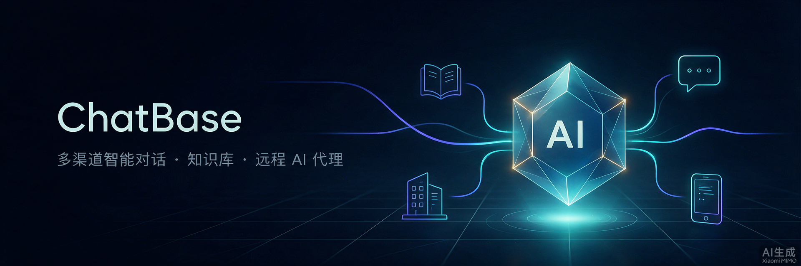
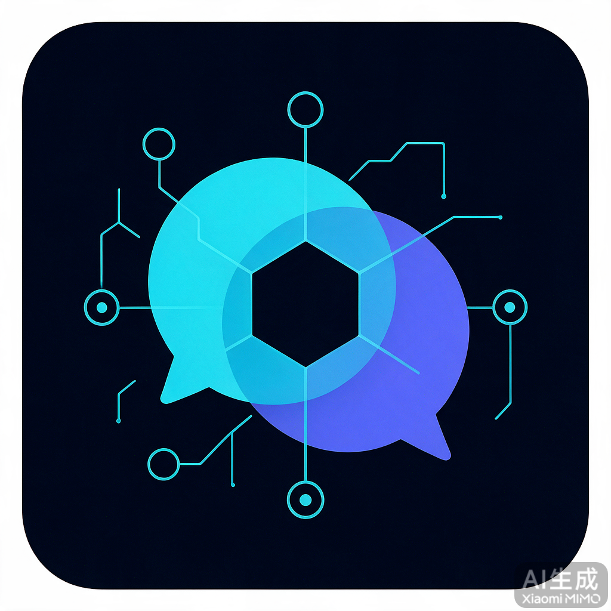
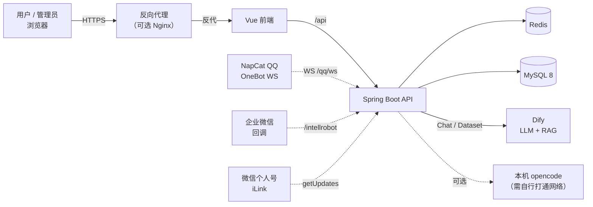

<div align="center">



</div>

# ChatBase · 智能对话客服系统 / Multi-channel AI Customer-Service System

> 把 QQ / 企业微信 / 微信个人号的消息统一接入 Dify 大模型 + 知识库，自动智能回复；
> 还支持将私聊会话绑定到本机 **opencode**，实现远程驱动本地 AI 编程代理。
>
> **Turn QQ / WeCom / personal WeChat into an AI assistant** backed by Dify LLM + RAG knowledge — and optionally remote-drive an opencode agent on your own machine.

<div align="center">


**一键 Docker 部署 / One-command deploy**  ·
**Token·费用看板 / Analytics dashboard**  ·
**可选远程本地 AI / Optional remote local-agent control**

</div>

---

## 目录 / Table of Contents

- [项目简介 · What is it](#项目简介--what-is-it)
- [核心特性 · Features](#核心特性--features)
- [技术栈 · Tech Stack](#技术栈--tech-stack)
- [系统架构 · Architecture](#系统架构--architecture)
- [快速开始 · Quick Start](#快速开始--quick-start)
- [配置说明 · Configuration](#配置说明--configuration)
- [功能模块 · Modules](#功能模块--modules)
- [数据隔离与权限 · Security & Isolation](#数据隔离与权限--security--isolation)
- [多渠道 IM 接入 · IM Integration](#多渠道-im-接入--im-integration)
- [机器人命令 · Bot Commands](#机器人命令--bot-commands)
- [可选：远程 opencode · Optional remote opencode](#可选远程-opencode--optional-remote-opencode)
- [数据库表 · Database](#数据库表--database)
- [API 接口 · API](#api-接口--api)
- [文档 · Docs](#文档--docs)
- [项目结构 · Project Structure](#项目结构--project-structure)
- [许可证 · License](#许可证--license)

---

## 项目简介 / What is it



ChatBase 是一套**开箱即用的多渠道智能客服 + AI 知识库**解决方案。后端对接 Dify 大模型，前端提供管理看板，把分散在 QQ、企业微信、微信个人号里的用户消息统一汇聚、自动回复、沉淀为知识库，并支持数据统计与反馈闭环。

- **多渠道统一抽象**：QQ 走 NapCat（WebSocket + WebUI 扫码）、企业微信走回调、微信个人号走 iLink，差异被收敛到同一套 IM 消息模型。
- **知识库优先**：FAQ 优先命中，未命中再走大模型，并附带引用来源。
- **可选远程编码代理**：私聊会话可绑定本机 opencode，通过安全隧道远程驱动本地 AI（仅 admin，可关闭）。

**Keywords:** AI chatbot · customer service · RAG knowledge base · Dify · QQ Bot (NapCat) · WeCom · WeChat personal · remote coding agent · opencode · Vue 3 · Spring Boot

---

## 核心特性 / Features

| 模块 Tier | 能力 What you get | 说明 |
|-----------|------------------|------|
|  **AI 对话 / Dialogue** | Dify 多轮对话、FAQ 优先命中、引用溯源 | 基于会话上下文，命中 FAQ 优先返回，未命中走大模型；带 Retriever 引用来源 |
|  **知识库 / Knowledge** | 批量传文档、自动同步 Dify、分类、搜索 | 支持 TXT/PDF/DOCX/MD，Dify Dataset 同步，树形分类，进度条（SSE） |
|  **多渠道 IM / Channels** | QQ 群/私聊、企微回调、微信 iLink | 统一消息抽象，扫码/回调接入，群与私聊全覆盖 |
|  **远程 opencode / Remote** | 私聊绑定本机 opencode（可选） | 会话级绑定特殊应用（appId=-1），仅 admin，默认关闭 |
|  **数据洞察 / Analytics** | Token/费用趋势、关键词云、群活跃、命中率 | 按日/月统计，支持 admin 切换到全部/个人维度 |
|  **FAQ & 反馈 / Feedback** | 高频问答自动抽取、评分、后台处理 | 星级+类型+描述反馈，管理员回复，满意度分析 |
|  **机器人命令 / Bot Commands** | 微信/企微交互式命令（/help /new /status 等） | 8 个内置命令，支持中英文别名，可扩展 |
|  **权限隔离 / Security** | admin/user 角色 + `created_by` 数据隔离 | 拦截器鉴权 + 查询级数据过滤；默认关闭自助注册 |

---

## 技术栈 / Tech Stack

### 后端 / Backend

| 技术 Technology | 版本 | 用途 Purpose |
|-----------------|------|--------------|
| Java | 17 | 开发语言 |
| Spring Boot | 2.7.6 | 应用框架 |
| MyBatis-Plus | 3.5.15 | ORM |
| WebSocket | - | QQ 机器人通信 |
| Redis | 7 | 缓存 / 会话 / 消息队列(Stream) |
| MySQL | 8.0 | 关系数据库 |
| Apache HttpClient | 4.5.14 | HTTP 调用 Dify 等 |
| Fastjson | 2.0.40 | JSON 处理 |
| Spring Security Crypto | 5.7 | BCrypt 密码加密 / AES |

### 前端 / Frontend

| 技术 Technology | 版本 | 用途 Purpose |
|-----------------|------|--------------|
| Vue | 3.5 | UI 框架 (Composition API) |
| TypeScript | 5.7 | 类型安全 |
| Vite | 6.1 | 构建工具 |
| ECharts | 6.0 | 数据可视化（趋势图 / 词云） |
| Lucide Icons | - | 图标库 |
| CropperJS | 1.6.2 | 头像裁切 |

---

## 系统架构 / Architecture

> 交互式架构图：[docs/chatbase-architecture.html](./docs/chatbase-architecture.html)



典型部署：反向代理 → 前端 → 后端 API；数据层为 MySQL + Redis；外部依赖为 Dify，以及可选的 NapCat / 企微回调 / iLink / opencode。

---

## 快速开始 / Quick Start

### Docker 部署（推荐）/ Docker Deploy (recommended)

```bash
# 1. 克隆项目
git clone <repository-url>
cd chatBase

# 2. 配置环境变量
cp .env.example .env
vim .env    # 填写必填配置

# 3. 构建并启动
docker compose up --build -d

# （可选）启动含 QQ Bot 的服务
docker compose --profile qq up --build -d

# 4. 查看日志
docker compose logs -f chatbase-backend
```

访问 **http://localhost** 打开前端页面。

### 本地开发 / Local Dev

```bash
# 1. 启动 MySQL 和 Redis
docker run -d --name mysql -p 3306:3306 -e MYSQL_ROOT_PASSWORD=your_root_password -e MYSQL_DATABASE=chat_base mysql:8.0
docker run -d --name redis -p 6379:6379 redis:7

# 2. 初始化数据库
mysql -u root -pyour_root_password chat_base < sql/init-schema.sql

# 3. 启动后端（local profile；application-local.yaml 被 git 忽略，需自建）
mvn spring-boot:run -Dspring-boot.run.profiles=local

# 4. 启动前端
cd web && npm install && npm run dev
```

访问 **http://localhost:5173** 打开前端页面。

> 生产环境 TLS、服务编排、可选组件与排错，请阅读 [DEPLOY.md](./DEPLOY.md)。

---

## 配置说明 / Configuration

### 必填配置 / Required

| 环境变量 Env | 说明 | 示例 |
|--------------|------|------|
| `MYSQL_ROOT_PASSWORD` | MySQL root 密码 | `your_root_password` |
| `MYSQL_USER` | 数据库用户名 | `chatbase` |
| `MYSQL_PASSWORD` | 数据库密码 | `your_password` |
| `DIFYAPP_API_KEY` | Dify Chat API Key | `app-xxxxxxxx` |
| `DIFYAPP_DATASET_API_KEY` | Dify Dataset API Key | `dataset-xxxxxxxx` |

### 可选配置 / Optional

| 环境变量 Env | 说明 | 默认值 Default |
|--------------|------|----------------|
| `REDIS_PASSWORD` | Redis 密码 | 无 |
| `QQ_BOT_ENABLE` | 启用 QQ 机器人 | `false` |
| `QQ_BOT_ACCESS_TOKEN` | NapCat Token | - |
| `QQ_BOT_SELF_ID` | 机器人 QQ 号 | - |
| `QQ_BOT_HTTP_BASE_URL` | NapCat HTTP 地址 | `http://chatbase-napcat:3000` |
| `QQ_BOT_WEBUI_BASE_URL` | NapCat WebUI 地址（扫码登录代理） | `http://chatbase-napcat:6099` |
| `QQ_BOT_WEBUI_TOKEN` | NapCat WebUI 鉴权 token | - |
| `WECHAT_CORP_STOKEN` | 企业微信 Token | - |
| `WECHAT_CORP_S_ENCODING_AES_KEY` | 企业微信 EncodingAESKey | - |
| `WECHAT_CORP_BOT_ID` | 企微机器人 ID | - |
| `WECHAT_CORP_SECRET` | 企微机器人 Secret | - |
| `WX_BOT_ENABLE` | 启用微信个人号 iLink | `false` |
| `WX_BOT_TOKEN` | 微信 iLink token | - |
| `WX_BOT_BASE_URL` | 微信 iLink 服务地址 | - |
| `WX_BOT_BOT_ID` | 微信机器人 ID | - |
| `WX_BOT_NICKNAME` | 微信机器人昵称 | `微信机器人` |
| `OPENCODE_ENABLED` | 启用本地 opencode 集成 | `false` |
| `OPENCODE_BASE_URL` | opencode serve 地址 | - |
| `OPENCODE_PASSWORD` | opencode serve 密码 | - |
| `OPENCODE_USERNAME` | opencode Basic Auth 用户名 | `opencode` |
| `OPENCODE_DEFAULT_DIRECTORY` | 本机项目根目录 | - |
| `OPENCODE_DEFAULT_AGENT` | opencode agent | `build` |
| `OPENCODE_TIMEOUT_SECONDS` | 等待回复超时（秒） | `300` |
| `JAVA_OPTS` | JVM 参数 | `-Xms512m -Xmx2048m` |
| `NAPCAT_IMAGE` | NapCat 镜像名称 | `mlikiowa/napcat-docker:v4.17.46` |

> 完整配置说明见 [USER_GUIDE.md](./USER_GUIDE.md)。**请勿将真实密钥写入仓库；使用 `.env`（已 gitignore）。**

---

## 功能模块 / Modules

| 模块 Module | 包路径 Package | 职责 Responsibility |
|-------------|----------------|---------------------|
| **chat** | `com.zxl.chatbase.chat` | 聊天会话、消息处理、数据清理 |
| **dify** | `com.zxl.chatbase.dify` | Dify API 集成、对话、文件上传 |
| **kb** | `com.zxl.chatbase.kb` | 知识库、分类、文档、FAQ、应用、关键词 |
| **im** | `com.zxl.chatbase.im` | IM 消息采集、会话绑定、机器人管理 |
| **command** | `com.zxl.chatbase.command` | 机器人交互命令框架 |
| **opencode** | `com.zxl.chatbase.opencode` | 可选：本地 opencode serve 集成 |
| **qq** | `com.zxl.chatbase.qq` | QQ 机器人 WebSocket + WebUI 扫码登录代理 |
| **wxroboot** | `com.zxl.chatbase.wxroboot` | 企业微信回调处理、消息加解密 |
| **statistics** | `com.zxl.chatbase.statistics` | 统计分析、Token、费用、关键词聚合 |
| **feedback** | `com.zxl.chatbase.feedback` | 用户反馈收集与统计 |
| **user** | `com.zxl.chatbase.user` | 登录认证、管理员建号、信息管理 |
| **upload** | `com.zxl.chatbase.upload` | 文件上传进度（SSE） |
| **config** | `com.zxl.chatbase.config` | 配置类、拦截器、跨域、限流 |

### 页面功能 / Pages

| 页面 Page | 路径 Route | 权限 | 功能 |
|-----------|-----------|------|------|
| 登录 | `/login` | 公开 | 用户登录（无自助注册入口） |
| 系统概览 | `/console/dashboard` | 登录 | 统计卡片、快捷导航 |
| 数据统计 | `/console/statistics` | 登录 | Token/费用趋势、词云、活跃度 |
| 群聊采集 | `/console/im` | 登录 | 群列表、消息查询、应用绑定 |
| 私聊采集 | `/console/im/single` | 登录 | 私聊会话、应用/opencode 绑定（opencode 仅 admin） |
| 知识库管理 | `/console/knowledge` | 登录 | 分类、知识库、文档、FAQ |
| 应用管理 | `/console/app` | 登录 | Dify 应用配置、API Key 验证 |
| 机器人管理 | `/console/bots` | 登录 | 机器人状态、消息统计、扫码登录 |
| FAQ 管理 | `/console/faq` | 登录 | 手动维护、自动提取 |
| AI 问答 | `/chat` | 公开 | 多会话对话、文件附件、引用来源 |
| 用户反馈 | `/feedback` | 公开 | 提交反馈、查看历史 |
| 反馈管理 | `/console/feedback-manage` | admin | 反馈处理、回复 |
| 应用管理(全部) | `/console/admin/apps` | admin | 所有应用管理 |
| 知识库管理(全部) | `/console/admin/kbs` | admin | 所有知识库管理 |
| 用户管理 | `/console/admin/users` | admin | 创建用户、角色/状态、删除 |

---

## 数据隔离与权限 / Security & Isolation

- **角色模型**：`admin` / `user`，`AuthInterceptor` + `AdminInterceptor` 双重校验
- **数据隔离规则**：`created_by = 当前用户 OR created_by IS NULL`（系统级记录所有人可见）
- **统计页**：admin 默认看全部（`scope=all`），可切 `scope=mine`；普通用户始终只看自己
- **群聊可见性**：`created_by IS NULL`（公共/未认领）或 `created_by = 当前用户`
- **应用/知识库**：按 `created_by` 过滤；admin 管理端看全部
- **账号策略**：默认关闭公开注册，管理员在后台建号
- **密钥管理**：Dify / IM / opencode 密钥均通过环境变量注入，勿提交到仓库

> 开发提示：`pom.xml` 的 `maven-compiler-plugin` 需配置 `<parameters>true</parameters>`，否则 `@RequestParam` / `@RequestAttribute` 可能报 `Name not specified`。

---

## 多渠道 IM 接入 / IM Integration

| 平台 Platform | 接入方式 | 功能 |
|---------------|----------|------|
| **QQ 群聊** | NapCat 反向 WebSocket | 扫码登录、消息收集、智能回复 |
| **QQ 私聊** | NapCat 反向 WebSocket | 会话级应用绑定 |
| **企业微信** | 回调模式 | 消息收集、智能回复、AES 加解密 |
| **微信个人号** | iLink 协议 | 消息收集、智能回复 |

### QQ 机器人（NapCat）

```bash
docker compose --profile qq up -d
```

- **WebUI 扫码登录**：在「机器人管理」页操作，或直接访问 NapCat WebUI
- **反向 WebSocket**：`ws://chatbase-backend:8080/qq/ws`
- **HTTP**：端口 `3000`；WebUI：端口 `6099`
- **ChatBase 配置**：`QQ_BOT_*` 环境变量（见配置表）

> 建议使用 QQ **小号** 以降低封号风险。群聊回复默认在消息 **@机器人** 时触发。

### 企业微信

- 回调 URL：`http://<your-host>/intellrobot/callback/handle`
- 配置 `WECHAT_CORP_*` 环境变量
- 企微要求 5 秒内响应，系统采用异步处理 + Redis 锁防重复

---

## 机器人命令 / Bot Commands

以 `/` 开头的消息由命令分发器处理，不走 Dify/opencode。

| 命令 Command | 别名 Alias | 说明 Description |
|-------------|-----------|-----------------|
| `/help` | `/帮助` | 显示所有可用命令 |
| `/new` | `/重置` | 重置会话 |
| `/status` | `/状态` | 机器人状态、绑定应用、会话信息 |
| `/history [N]` | `/历史` | 最近 N 条对话（默认 5，最大 20） |
| `/feedback <内容>` | `/反馈` | 提交反馈 |
| `/clear` | `/清空` | 清空当前会话上下文 |
| `/app` | `/应用` | 当前绑定应用信息 |
| `/stats` | `/统计` | 个人使用统计 |

**扩展**：实现 `CommandHandler` 接口并标注 `@Component`，即可自动注册。

---

## 可选：远程 opencode / Optional remote opencode

将私聊会话绑定到开发者本机的 `opencode serve`，实现远程驱动本地 AI 编程代理。

**前提**
1. 本机运行 `opencode serve` 并设置 Basic Auth 密码
2. 服务器可访问该服务（同机直连，或自行打通隧道/内网）
3. 配置 `OPENCODE_ENABLED=true`、`OPENCODE_BASE_URL`、`OPENCODE_PASSWORD`
4. 以 **admin** 在「私聊采集」中绑定「本地opencode」（仅 admin 可见）

会话映射存于 Redis（TTL 7 天），回复写入 `kb_conversation` 审计后再回发私聊。

> 安全提醒：opencode 具备本机执行能力，请仅在可信网络暴露，并强制鉴权。隧道与容器网络等部署细节见 [DEPLOY.md](./DEPLOY.md)。

---

## 数据库表 / Database

| 表名 Table | 说明 |
|-----------|------|
| `sys_user` | 系统用户 |
| `kb_category` | 知识库分类 |
| `kb_knowledge_base` | 知识库 |
| `kb_document` | 文档 |
| `kb_conversation` | 会话记录（含 Token/费用） |
| `kb_faq` | 常见问答 |
| `kb_feedback` | 用户反馈 |
| `kb_statistics` | 每日统计 |
| `kb_keyword` | 关键词 |
| `kb_app` | 应用配置 |
| `im_conversation` | IM 单聊会话 |
| `group_message` | IM 消息采集 |
| `im_group` / `im_user` | 群组 / 用户 |
| `chat_session` | Web 聊天会话 |
| `sys_config` | 系统配置 |

> 表结构详见 [DESIGN.md](./DESIGN.md)。已有库升级：执行 `sql/upgrade-existing-db.sql`（幂等）。

---

## API 接口 / API

| 分类 | 路径前缀 | 说明 |
|------|----------|------|
| 用户 | `/api/user` | 登录、管理员建号、信息管理 |
| 聊天 | `/api/chat` | 对话、文件上传 |
| 会话 | `/api/chat/session` | 会话 CRUD |
| 知识库 | `/api/kb` | 知识库、分类、文档 |
| 应用 | `/api/kb/app` | 应用管理、API Key 验证 |
| FAQ | `/api/kb/conversation/faq` | FAQ CRUD、提取 |
| 反馈 | `/api/feedback` | 提交、管理、统计 |
| 统计 | `/api/statistics` | Token、费用、关键词、聚合 |
| 控制台 | `/api/console` | 群聊采集、私聊会话、消息 |
| 机器人 | `/api/bot` | 机器人列表 |
| 上传进度 | `/api/upload/progress` | SSE 实时推送 |
| QQ Bot | `/api/qq-bot` | QQ 扫码登录代理 |

> 完整 API 列表见 [DESIGN.md](./DESIGN.md)。

---

## 文档 · Docs

| 文档 | 说明 |
|------|------|
| [USER_GUIDE.md](./USER_GUIDE.md) | 使用文档：部署、配置、功能、排查、FAQ |
| [DEPLOY.md](./DEPLOY.md) | 部署指南：Docker、环境变量、服务管理、可选组件 |
| [DESIGN.md](./DESIGN.md) | 详细设计：架构、模块、数据库、数据流、API |
| [OPS_TROUBLESHOOTING.md](./OPS_TROUBLESHOOTING.md) | 运维排障笔记（面向运维，非产品文档） |

---

## 项目结构 / Project Structure

```
chatBase/
├── src/main/java/com/zxl/chatbase/
│   ├── chat/           # 聊天服务
│   ├── command/        # 机器人交互命令框架
│   ├── dify/           # Dify API 集成
│   ├── kb/             # 知识库管理
│   ├── im/             # IM 消息采集
│   ├── opencode/       # 可选：本地 opencode 集成
│   ├── qq/             # QQ Bot
│   ├── wxroboot/       # 企业微信机器人
│   ├── statistics/     # 统计分析
│   ├── feedback/       # 用户反馈
│   ├── user/           # 用户管理
│   ├── config/         # 配置类
│   ├── common/         # 通用工具、限流、异常
│   └── controller/     # API 控制器
│
├── web/                # Vue 3 前端
├── sql/                # 数据库脚本
├── assets/             # README 图片资源
├── docs/               # 架构图等
├── Dockerfile
├── docker-compose.yml
├── .env.example
├── DESIGN.md
├── USER_GUIDE.md
└── DEPLOY.md
```

---

## 许可证 / License

[MIT License](./LICENSE) © 2026 ZxlDragonDoctor

---

*最后更新 / Last updated：2026-09-12 · 中文为主 / Chinese-primary, English-mirror*
