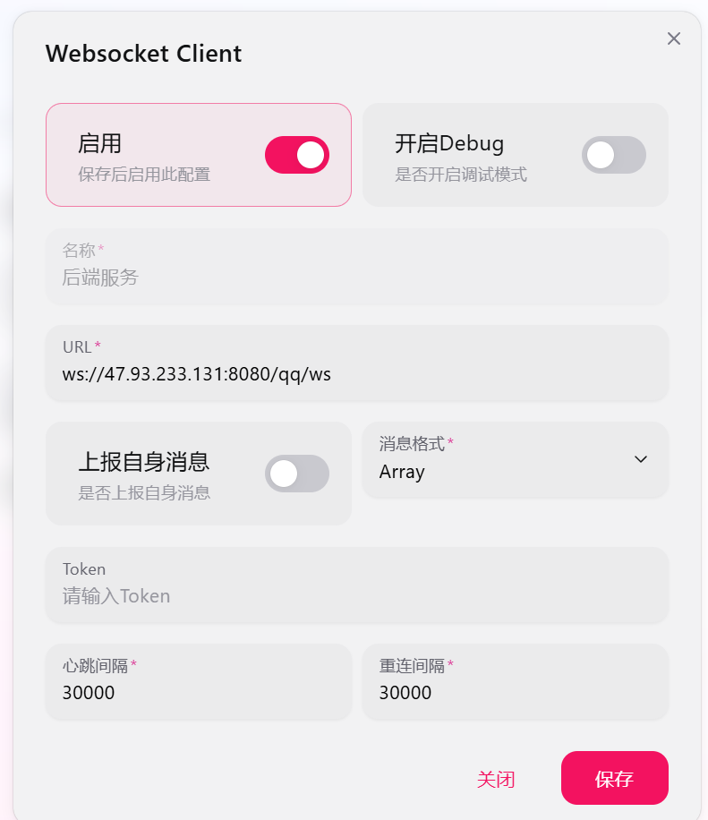
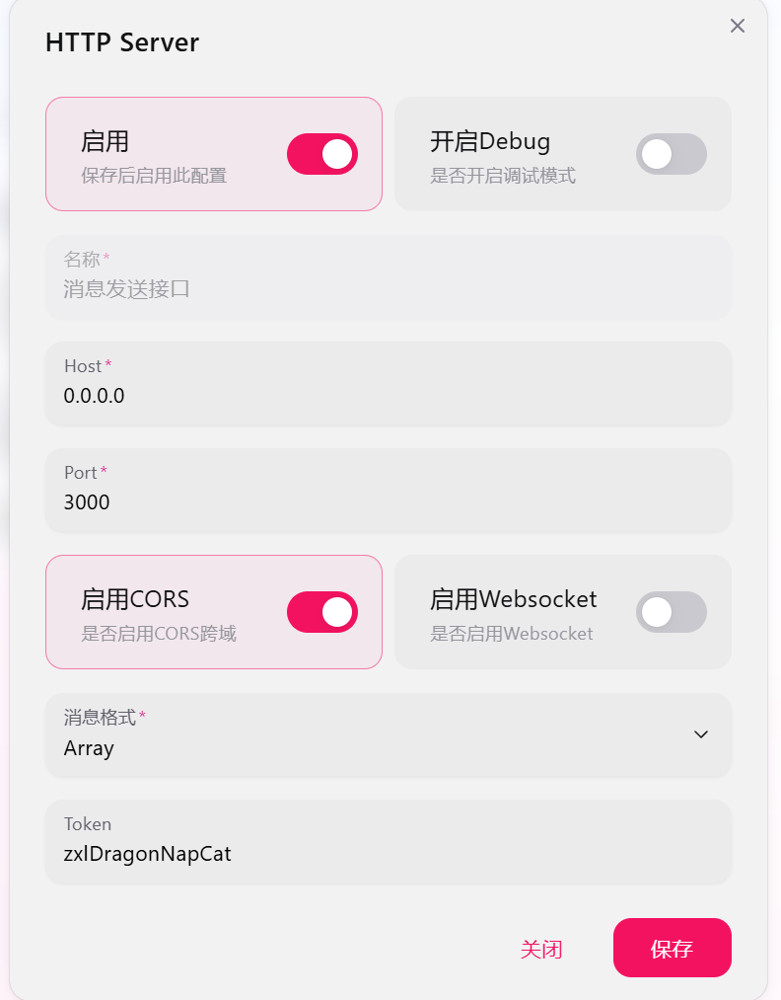

# ChatBase

基于 Spring Boot + Vue 3 的智能对话系统，集成 Dify AI 平台，支持 QQ 群聊和企业微信消息收集与智能回复。

## 功能特性

### 核心功能
- **智能对话**：集成 Dify AI，支持多轮对话、上下文记忆
- **知识库管理**：批量上传文档、自动同步到 Dify 知识库、搜索功能
- **FAQ 管理**：自动提取高频问答、手动维护、优先级匹配、搜索功能
- **会话管理**：多会话切换、历史记录查询

### IM 集成
- **QQ 群聊**：通过 NapCat 接入，自动回复群消息
- **企业微信**：接收企业微信群消息，智能回复

### 数据分析
- **Token 统计**：消耗趋势图、月度统计、预测分析
- **费用统计**：Prompt/Completion Tokens 分离计费、费用趋势
- **关键词热度**：词云展示、多渠道关键词提取
- **用户反馈**：点赞/踩统计、反馈表单、满意度分析

## 技术栈

### 后端
- Java 17
- Spring Boot 2.7.6
- MyBatis-Plus
- WebSocket
- Redis
- MySQL 8.0

### 前端
- Vue 3 + TypeScript
- Vite
- ECharts
- Lucide Icons

### AI 平台
- Dify API

## 快速开始

### Docker 部署（推荐）

```bash
# 1. 克隆项目
git clone <repository-url>
cd chatBase

# 2. 配置环境变量
cp .env.example .env
vim .env  # 填写 Dify API Key 等必填配置

# 3. 构建并启动
docker-compose up --build -d

# 4. 查看日志
docker-compose logs -f chatbase-backend
```

访问 `http://localhost` 打开前端页面。

详细部署说明请参考 [DEPLOY.md](./DEPLOY.md)。

### 本地开发

```bash
# 后端
mvn spring-boot:run

# 前端
cd web
npm install
npm run dev
```

## 目录结构

```
chatBase/
├── src/main/java/com/zxl/chatbase/
│   ├── chat/           # 聊天服务
│   ├── dify/           # Dify API 集成
│   ├── kb/             # 知识库管理
│   ├── im/             # IM 消息收集
│   ├── qq/             # QQ Bot WebSocket
│   ├── statistics/     # 统计分析
│   ├── feedback/       # 用户反馈
│   └── controller/     # API 控制器
│
├── web/                # Vue 3 前端
│   ├── src/
│   │   ├── pages/      # 页面组件
│   │   ├── api/        # API 接口
│   │   └── lib/        # 工具库
│   ├── nginx.conf      # Nginx 配置
│   └── Dockerfile      # 前端镜像
│
├── sql/                # 数据库脚本
│   └── init-schema.sql # 初始化脚本
│
├── Dockerfile          # 后端镜像
├── docker-compose.yml  # 部署编排
├── .env.example        # 环境变量示例
├── DEPLOY.md           # 部署说明
└── README.md           # 项目说明
```

## 配置说明

### 必填配置

| 配置项 | 说明 |
|--------|------|
| `DIFYAPP_API_KEY` | Dify Chat API Key |
| `DIFYAPP_DATASET_API_KEY` | Dify Dataset API Key |
| `MYSQL_PASSWORD` | MySQL 数据库密码 |

### 可选配置

| 配置项 | 说明 |
|--------|------|
| `QQ_BOT_ENABLE` | 启用 QQ Bot |
| `QQ_BOT_SELF_ID` | 机器人 QQ 号 |
| `WECHAT_CORP_STOKEN` | 企业微信 Token |

## API 接口

### 对话接口
| 接口 | 方法 | 说明 |
|------|------|------|
| `/api/chat/ask` | GET | 简单问答 |
| `/api/chat/web` | POST | Web 端对话 |
| `/api/chat/im` | POST | IM 端对话 |
| `/api/chat/v1/files/upload` | POST | 文件上传 |

### 知识库接口
| 接口 | 方法 | 说明 |
|------|------|------|
| `/api/kb` | GET/POST/PUT/DELETE | 知识库 CRUD |
| `/api/kb/{id}/sync` | POST | 同步到 Dify |
| `/api/kb/{id}/batch-upload` | POST | 批量上传文件 |
| `/api/kb/{id}/document/page` | GET | 文档列表（支持搜索） |

### 统计接口
| 接口 | 方法 | 说明 |
|------|------|------|
| `/api/statistics/token/chart` | GET | Token 趋势 |
| `/api/statistics/token/monthly` | GET | 本月统计 |
| `/api/statistics/cost/chart` | GET | 费用趋势 |
| `/api/statistics/keyword/cloud` | GET | 关键词词云 |
| `/api/statistics/aggregate` | POST | 聚合统计 |

### FAQ 接口
| 接口 | 方法 | 说明 |
|------|------|------|
| `/api/kb/conversation/faq/page` | GET | FAQ 列表（支持搜索） |
| `/api/kb/conversation/faq/extract` | POST | 自动提取 FAQ |

## 数据库表

### 知识库模块
| 表名 | 说明 |
|------|------|
| `kb_knowledge_base` | 知识库管理 |
| `kb_document` | 文档管理 |
| `kb_conversation` | 会话记录 |
| `kb_faq` | 常见问答 |
| `kb_feedback` | 用户反馈 |
| `kb_statistics` | 每日统计 |
| `kb_keyword` | 关键词统计 |

### IM 模块
| 表名 | 说明 |
|------|------|
| `group_message` | 群聊消息采集 |
| `im_group` | 群组信息 |
| `im_user` | 用户信息 |
| `chat_session` | 聊天会话 |

### 系统模块
| 表名 | 说明 |
|------|------|
| `sys_user` | 系统用户 |
| `sys_config` | 系统配置 |

## QQ Bot 配置

使用 NapCat 作为 QQ 协议实现：

1. 启动 NapCat 容器
```bash
docker compose --profile qq up -d
```

2. 访问 `http://<server>:6099` 扫码登录，并配置网络配置

3. 配置反向 WebSocket客户端：


4.配置Http服务器


项目地址：https://github.com/NapNeko/NapCatQQ

⚠️ **注意**：务必使用小号登录，防止被封禁。

## 企业微信配置

在企业微信管理后台配置机器人：

1. **回调URL**：`http://<server>/intellrobot/callback/handle`
2. **配置参数**：
   - `WECHAT_CORP_STOKEN` - Token
   - `WECHAT_CORP_S_ENCODING_AES_KEY` - EncodingAESKey

3. 消息处理流程：
   - GET 请求：URL验证
   - POST 请求：接收消息并回复

## 数据流程

### QQ 群消息收集
```
QQ群消息 → NapCat → WebSocket(/qq/ws) 
→ QqBotWebSocketHandler → group_message 表
→ 定时同步到 Dify 知识库
```

### 企业微信群消息收集
```
企业微信群消息 → 回调(/intellrobot/callback/handle)
→ IntelligentRobotService → 消息解密验证
→ group_message 表 + im_group/im_user 表同步
→ ChatService(Dify API) → 返回答案 → Webhook回复群聊
```

### Web 对话流程
```
用户提问 → ChatController → ChatService
→ FAQ匹配(优先) / Dify API调用
→ kb_conversation 表 → 返回答案
```

## 定时任务

系统中的定时任务汇总如下：

| 序号 | 类名 | 方法名 | 执行频率 | 功能说明 | 状态 |
|:----:|------|--------|----------|----------|:----:|
| 1 | GroupMessageSyncServiceImpl | syncToKnowledgeBase() | 每60秒 | 同步群消息到Dify知识库，批量查询未同步的消息并创建文档 | ⚠️ 已过时 |
| 2 | GroupMessageConsumer | consumeMessages() | 每5秒 | Redis Stream消息消费者，实时处理新消息 | ✅ 推荐 |
| 3 | StatisticsAggregateServiceImpl | aggregateYesterdayStatistics() | 每天 00:05 | 聚合昨日统计数据，包括会话数、Token消耗、费用等 | ✅ |
| 4 | KeywordSyncServiceImpl | syncKeywordsFromMessages() | 每天 05:00 | 从群聊消息和Web对话中批量提取关键词，更新关键词统计数据 | ✅ |
| 5 | KeywordSyncServiceImpl | cleanOldKeywords() | 每天 06:00 | 清理超过保留期限的关键词，默认保留90天 | ✅ |
| 6 | CleanupServiceImpl | cleanupExpiredConversations() | 每天 03:00 | 清理Redis和数据库中过期的会话数据 | ✅ |
| 7 | CleanupServiceImpl | cleanupOldMessages() | 每天 04:30 | 清理超过保留期限的消息数据 | ✅ |

### 定时任务详情

#### 1. 群消息同步 (GroupMessageSyncServiceImpl) ⚠️ 已过时
- **状态**: ⚠️ 已过时，推荐使用 Redis Stream 消息队列方案
- **文件位置**: `src/main/java/com/zxl/chatbase/im/service/impl/GroupMessageSyncServiceImpl.java`
- **执行频率**: 每60秒（fixedDelayString = "60000"）
- **功能**:
  - 查询 `synced = false` 的群消息（每次最多200条）
  - 按群ID分组，每群一个文档
  - **自动创建默认"群聊消息"分类**：如果不存在则创建
  - **自动创建默认"群聊助手知识库"**：如果不存在则创建，并调用Dify API创建Dataset
  - 创建/更新知识库和文档
- **问题**:
  - 无消息时仍执行数据库查询，浪费资源
  - 最大延迟60秒才能处理新消息
  - 数据库频繁查询增加压力

#### 1.1 群消息同步 (GroupMessageConsumer) ✅ 推荐方案
- **状态**: ✅ 推荐使用
- **文件位置**: `src/main/java/com/zxl/chatbase/im/consumer/GroupMessageConsumer.java`
- **执行频率**: 每5秒（阻塞读取，有消息立即处理）
- **方案**: Redis Stream 消息队列
- **功能**:
  - 从 Redis Stream 消费新消息
  - 消息驱动实时处理，无需轮询
  - 支持消息确认机制
  - 调用 `syncSingleMessage()` 处理单条消息
- **优势**:
  - 消息驱动：新消息到达立即处理，无需定时轮询
  - 低延迟：秒级处理，无需等待60秒
  - 低资源：仅处理新消息，不频繁查询数据库
  - 高可靠：支持消息确认和失败重试

### Redis Stream 消息队列方案

#### 方案说明
- **触发方式**: 消息驱动（消息到达立即处理）
- **响应延迟**: 实时或秒级
- **资源消耗**: 仅处理新消息，无需轮询
- **配置项**: `im.sync.stream.enabled`（默认true）

#### 消息流程
```
QQ/企微消息到达 → WebSocket处理器 → Redis Stream → 消费者处理 → Dify知识库
                     ↓                                    ↓
                保存到数据库                          更新synced状态
```

#### 核心组件

| 组件 | 说明 |
|------|------|
| Stream Key | `chatbase:group:message:stream` |
| Consumer Group | `chatbase-sync-group` |
| 消费者 | `consumer-1` |

#### 配置说明
```yaml
im:
  sync:
    stream:
      enabled: true  # 启用Stream方案
    polling:
      enabled: false  # 禁用定时轮询
```

#### 待实现功能（可选）
- 消息失败重试机制
- 批量处理优化
- 多个消费者并行处理

#### 2. 每日统计聚合 (StatisticsAggregateServiceImpl)
- **文件位置**: `src/main/java/com/zxl/chatbase/statistics/service/impl/StatisticsAggregateServiceImpl.java`
- **执行频率**: 每天 00:05 (cron = "0 5 0 * * ?")
- **功能**:
  - 聚合昨日的会话统计数据
  - 统计会话数、消息数、Token消耗、费用等

#### 3. 关键词同步 (KeywordSyncServiceImpl)
- **文件位置**: `src/main/java/com/zxl\chatbase/kb/service/impl/KeywordSyncServiceImpl.java`
- **执行频率**: 每天 05:00 和 06:00
- **功能**:
  - `syncKeywordsFromMessages()`: 从最近7天的群聊消息和对话中提取关键词
  - `cleanOldKeywords()`: 清理超过90天的关键词

#### 4. 数据清理 (CleanupServiceImpl)
- **文件位置**: `src/main/java/com/zxl\chatbase/chat/service/impl/CleanupServiceImpl.java`
- **执行频率**: 每天 03:00 和 04:30
- **功能**:
  - `cleanupExpiredConversations()`: 清理Redis和数据库中的过期会话
  - `cleanupOldMessages()`: 清理超过90天的消息

### 注意事项

⚠️ **定时同步方案已过时**：
- 当前每60秒轮询方案（GroupMessageSyncServiceImpl.syncToKnowledgeBase）会造成资源浪费
- 建议改用 Redis Stream 消息队列方案（GroupMessageConsumer）
- 原定时任务保留作为降级方案（可通过 `im.sync.polling.enabled` 控制）

⚠️ **定时任务与手动删除的冲突**：
- 群消息同步任务会检查"群聊消息"分类是否存在，不存在则自动创建
- 群消息同步任务会检查"群聊助手知识库"是否存在，不存在则自动创建
- 如果手动删除该分类或知识库，定时任务会在60秒内重新创建

⚠️ **定时任务触发的默认知识库创建**：
- 当首次有群消息需要同步时，定时任务会自动创建：
  - **"群聊消息"分类**（分类名称，parent_id=0）
  - **"群聊助手知识库"**（知识库名称，source_type=im_sync）
- 这是隐式创建，没有独立的定时任务，但在 GroupMessageSyncServiceImpl.syncToKnowledgeBase() 中通过 findOrCreateImSyncCategory() 和 findOrCreateImSyncKnowledgeBase() 方法实现

⚠️ **统计数据延迟**：
- 统计聚合任务每天0:05执行，聚合的是昨日数据
- 当天的统计数据需要在次日才会显示

## 常见问题

1. **QQ消息收到但不回答**：确认 @机器人 而不是只发消息
2. **知识库删除失败**：检查 Dify API Key 配置是否正确
3. **统计数据为空**：调用 `/api/statistics/aggregate` 聚合统计
4. **Token费用显示为0**：历史数据无费用信息，新对话正常记录

## 默认数据创建

### 1. 默认应用（kb_app 表）

#### 创建时机
- 数据库初始化时（init-schema.sql）

#### 初始化数据
```sql
-- init-schema.sql 中的初始化语句
INSERT INTO `kb_app` 
  (`name`, `description`, `icon`, `dify_api_key`, `dify_app_name`, `dify_app_mode`, `is_default`, `is_public`, `create_by`, `status`)
VALUES 
  ('默认助手', '系统默认应用，使用配置文件中的API Key', 'robot', 'PLACEHOLDER_API_KEY', NULL, NULL, 1, 1, 'admin', 1)
ON DUPLICATE KEY UPDATE `update_time` = NOW();
```

#### 获取默认应用的逻辑（KbAppServiceImpl.getDefaultApp()）
```java
public KbApp getDefaultApp() {
    // 1. 首先查询 is_default = true 且 status = 1 的应用
    LambdaQueryWrapper<KbApp> wrapper = new LambdaQueryWrapper<>();
    wrapper.eq(KbApp::getStatus, true)
            .eq(KbApp::getIsDefault, true)
            .last("LIMIT 1");
    KbApp app = appMapper.selectOne(wrapper);
    
    // 2. 如果没有默认应用，则返回任意一个启用的应用
    if (app == null) {
        wrapper = new LambdaQueryWrapper<>();
        wrapper.eq(KbApp::getStatus, true).last("LIMIT 1");
        app = appMapper.selectOne(wrapper);
    }
    return app;
}
```

#### 应用获取优先级
1. 群组绑定的应用（优先）
2. 默认应用（is_default = true）
3. 任意启用的应用

### 2. 默认知识库（群聊助手知识库）

#### 创建时机
- 首次同步群消息时，由 `GroupMessageSyncServiceImpl` 定时任务触发

#### 创建流程
```
定时任务触发（每60秒） 
    ↓
findOrCreateImSyncCategory() 检查"群聊消息"分类
    ├── 存在 → 直接使用
    └── 不存在 → 创建新分类
        ↓
findOrCreateImSyncKnowledgeBase() 检查"群聊助手知识库"
    ├── 存在 → 直接使用
    └── 不存在 → 创建知识库 + 调用 Dify API 创建 Dataset
        ↓
保存到数据库
```

#### 关键代码位置
- **文件**：`src/main/java/com/zxl/chatbase/im/service/impl/GroupMessageSyncServiceImpl.java`

- **findOrCreateImSyncCategory()** - 第262-283行
  ```java
  private KbCategory findOrCreateImSyncCategory() {
      // 检查 name='群聊消息' AND status=true 的分类
      LambdaQueryWrapper<KbCategory> wrapper = new LambdaQueryWrapper<>();
      wrapper.eq(KbCategory::getName, "群聊消息")
              .eq(KbCategory::getStatus, true)
              .last("LIMIT 1");
      KbCategory category = kbCategoryMapper.selectOne(wrapper);
      
      // 不存在则创建
      if (category == null) {
          category = new KbCategory();
          category.setName("群聊消息");
          category.setDescription("群聊消息同步分类");
          category.setParentId(0L);
          category.setStatus(true);
          kbCategoryMapper.insert(category);
      }
      return category;
  }
  ```

- **findOrCreateImSyncKnowledgeBase()** - 第285-328行
  ```java
  private KbKnowledgeBase findOrCreateImSyncKnowledgeBase() {
      // 1. 获取或创建"群聊消息"分类
      KbCategory category = findOrCreateImSyncCategory();
      
      // 2. 检查"群聊助手知识库"是否存在
      LambdaQueryWrapper<KbKnowledgeBase> wrapper = new LambdaQueryWrapper<>();
      wrapper.eq(KbKnowledgeBase::getSourceType, "im_sync")
              .eq(KbKnowledgeBase::getName, "群聊助手知识库")
              .eq(KbKnowledgeBase::getStatus, true)
              .last("LIMIT 1");
      
      // 3. 不存在则创建
      if (kb == null) {
          kb = new KbKnowledgeBase();
          kb.setName("群聊助手知识库");
          kb.setDescription("所有群聊消息同步知识库");
          kb.setCategoryId(category.getId());
          kb.setSourceType("im_sync");
          // 调用 Dify API 创建 Dataset
          String difyDatasetId = difyService.createDataset(kb.getName(), kb.getDescription());
          kb.setDifyDatasetId(difyDatasetId);
          knowledgeBaseService.save(kb);
      }
      return kb;
  }
  ```

#### 相关配置常量
| 常量 | 值 | 说明 |
|------|-----|------|
| `IM_SYNC_KB_NAME` | 群聊助手知识库 | 知识库名称 |
| `IM_SYNC_CATEGORY_NAME` | 群聊消息 | 分类名称 |
| `IM_SYNC_SOURCE_TYPE` | im_sync | 来源类型 |

### 3. 配置说明

#### Dify API Key 来源
1. **数据库 kb_app 表**：`dify_api_key` 字段存储应用级 API Key
2. **配置文件**：`application-prod.yaml` 中的 `difyApp.apiKey` 环境变量
3. **优先级**：配置文件 > 数据库

#### 环境变量配置
```yaml
# application-prod.yaml
difyApp:
  url: https://api.dify.ai/v1
  apiKey: ${DIFYAPP_API_KEY}        # 来自 .env 文件
  datasetApiKey: ${DIFYAPP_DATASET_API_KEY}
```

### 4. 注意事项

⚠️ **删除"群聊消息"分类的问题**：
- 该分类由定时任务自动创建（每60秒检查）
- 删除后会在下一次同步时自动重建
- 如需删除该分类，需先禁用 IM 同步功能

⚠️ **默认应用 API Key**：
- 数据库初始化时使用占位符 `PLACEHOLDER_API_KEY`
- 部署时需在 `.env` 文件中配置真实的 `DIFYAPP_API_KEY`

⚠️ **定时任务配置**：
- `GroupMessageSyncServiceImpl.syncToKnowledgeBase()` 每60秒执行一次
- 定时任务会在启动后立即执行一次

